# Architecture Document

## Digital Twin–Driven RL for Medical Imaging Workflow Optimization

> LJMU Master's Thesis — Developer Reference
>
> ⚠️ **SYNTHETIC / RESEARCH DATA ONLY** — No real patient data.

---

## 1. System Overview

This project implements a **Hierarchical Multi-Agent Reinforcement Learning (MARL)** framework to optimize medical imaging workflows in hospitals. A **Digital Twin** simulates the hospital environment, and RL agents learn to make scheduling decisions that outperform traditional baselines (FIFO, Static Triage).

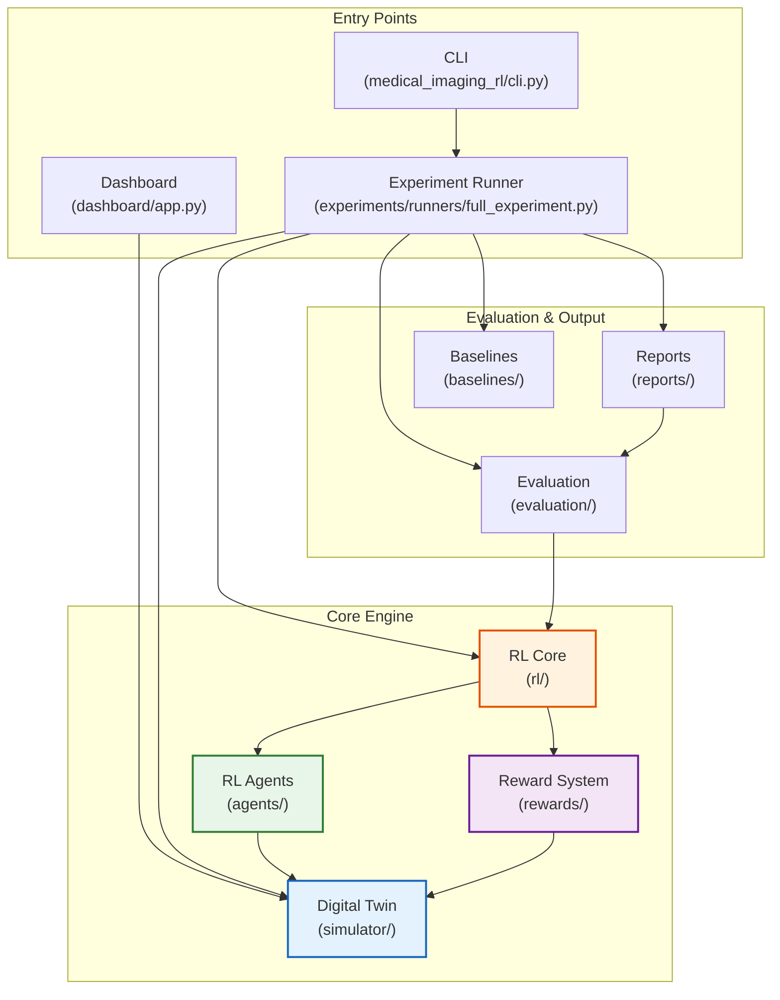

---

## 2. High-Level Data Flow

The core training loop follows this decision flow at every simulation step:

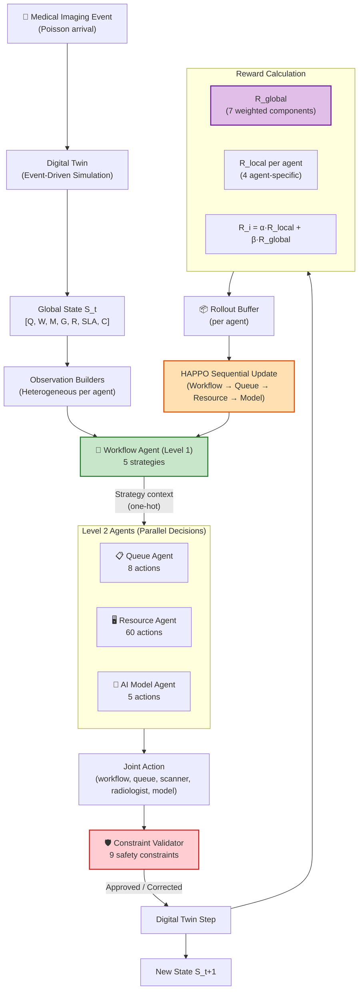

---

## 3. Module Architecture

### 3.1 Project Directory Structure

```
LJMU_MI_WF/
├── config.yaml                              # Master experiment configuration
├── pyproject.toml                           # Python project metadata
│
├── simulator/                               # 🏥 DIGITAL TWIN (Environment)
│   ├── digital_twin/environment.py          #   MedicalImagingDigitalTwin class
│   ├── events/
│   │   ├── event.py                         #   Event & EventType definitions
│   │   ├── event_queue.py                   #   Heap-based priority event queue
│   │   └── event_sources.py                 #   Poisson arrival generator
│   ├── state/
│   │   ├── study.py                         #   Study, Urgency, Modality, StudyStage
│   │   └── global_state.py                  #   7-component GlobalState
│   ├── resources/
│   │   └── resources.py                     #   Scanner, Radiologist, AIModel, GPUCluster
│   ├── scenarios/
│   │   └── scenario.py                      #   6 scenario configurations (A–F)
│   └── transitions/                         #   State transition logic
│
├── agents/                                  # 🧠 RL AGENTS
│   ├── observations.py                      #   4 heterogeneous observation builders
│   ├── workflow/agent.py                    #   Level 1: Workflow Agent (5 actions)
│   ├── queue/agent.py                       #   Level 2: Queue Agent (8 actions)
│   ├── resource/agent.py                    #   Level 2: Resource Agent (60 actions)
│   ├── model_selection/agent.py             #   Level 2: AI Model Agent (5 actions)
│   └── constraint_validator.py              #   9 deterministic safety constraints
│
├── rl/                                      # 📊 REINFORCEMENT LEARNING CORE
│   ├── ppo/
│   │   ├── actor_critic.py                  #   ActorCritic neural network
│   │   ├── buffer.py                        #   RolloutBuffer, MultiAgentRolloutBuffer
│   │   └── gae.py                           #   Generalized Advantage Estimation
│   ├── happo/
│   │   └── happo_trainer.py                 #   HAPPO sequential update trainer
│   ├── policies/                            #   Policy abstractions
│   ├── buffers/                             #   Buffer variants
│   └── training/
│       └── trainer.py                       #   ExperimentTrainer (main training loop)
│
├── rewards/                                 # 🎯 REWARD SYSTEM
│   ├── global_reward.py                     #   7-component weighted global reward
│   ├── workflow_reward.py                   #   Local reward for Workflow Agent
│   ├── queue_reward.py                      #   Local reward for Queue Agent
│   ├── resource_reward.py                   #   Local reward for Resource Agent
│   └── model_reward.py                      #   Local reward for AI Model Agent
│
├── baselines/                               # 📏 NON-LEARNING BASELINES
│   ├── fifo.py                              #   FIFO (first-come-first-served)
│   └── triage.py                            #   Static Triage (Critical > Urgent > Routine)
│
├── evaluation/                              # 📈 EVALUATION FRAMEWORK
│   ├── metrics.py                           #   19 primary/secondary metrics
│   ├── convergence.py                       #   Convergence detection
│   ├── statistics.py                        #   Welch's t-test, Mann-Whitney U, bootstrap CI
│   ├── acceptance.py                        #   Multi-criteria acceptance gate (8 criteria)
│   └── ablation.py                          #   Ablation study runner
│
├── experiments/                             # 🧪 EXPERIMENT PIPELINE
│   ├── runners/full_experiment.py           #   18-step experiment pipeline
│   └── configs/
│       └── quick.yaml                       #   Quick-run configuration
│
├── reports/                                 # 📄 OUTPUT GENERATION
│   ├── chart_generator.py                   #   Plotly charts (HTML + PNG)
│   ├── table_generator.py                   #   Thesis tables (CSV, Excel, Markdown)
│   └── report_generator.py                  #   HTML/Markdown reports
│
├── medical_imaging_rl/                      # 🔌 PACKAGE ENTRY POINT
│   ├── cli.py                               #   CLI with subcommands
│   └── logging.py                           #   Structured logging (structlog)
│
├── dashboard/                               # 🌐 WEB DASHBOARD
│   └── app.py                               #   FastAPI interactive dashboard
│
├── tests/                                   # ✅ TEST SUITE
└── results/                                 # 📂 OUTPUT (generated at runtime)
```

---

## 4. Digital Twin (Simulator)

The Digital Twin is the **environment** in the RL formulation. It is a stateful, discrete-event simulator that models a hospital's medical imaging workflow.

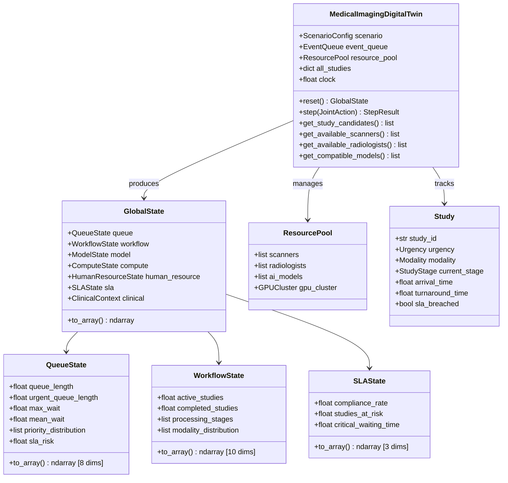

### Study Lifecycle

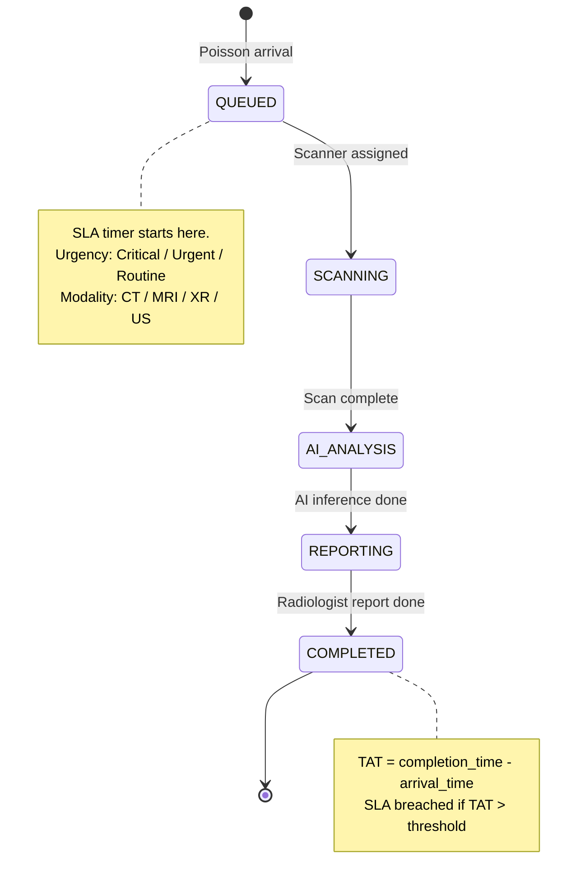

### Scenarios (A–F)

| ID | Name | Arrival Rate | Key Stress Factor |
|----|------|-------------|-------------------|
| A | Normal | 10/hr | Baseline — full resources |
| B | Peak | 20/hr | 2× arrival rate |
| C | High Urgent | 10/hr | 40% critical, 35% urgent |
| D | Low Compute | 10/hr | 50% GPU capacity |
| E | Low Radiologist | 10/hr | 50% radiologist availability |
| F | High Latency | 10/hr | 3× inference latency |

---

## 5. Agent Hierarchy

The system uses a **two-level hierarchical** multi-agent architecture:

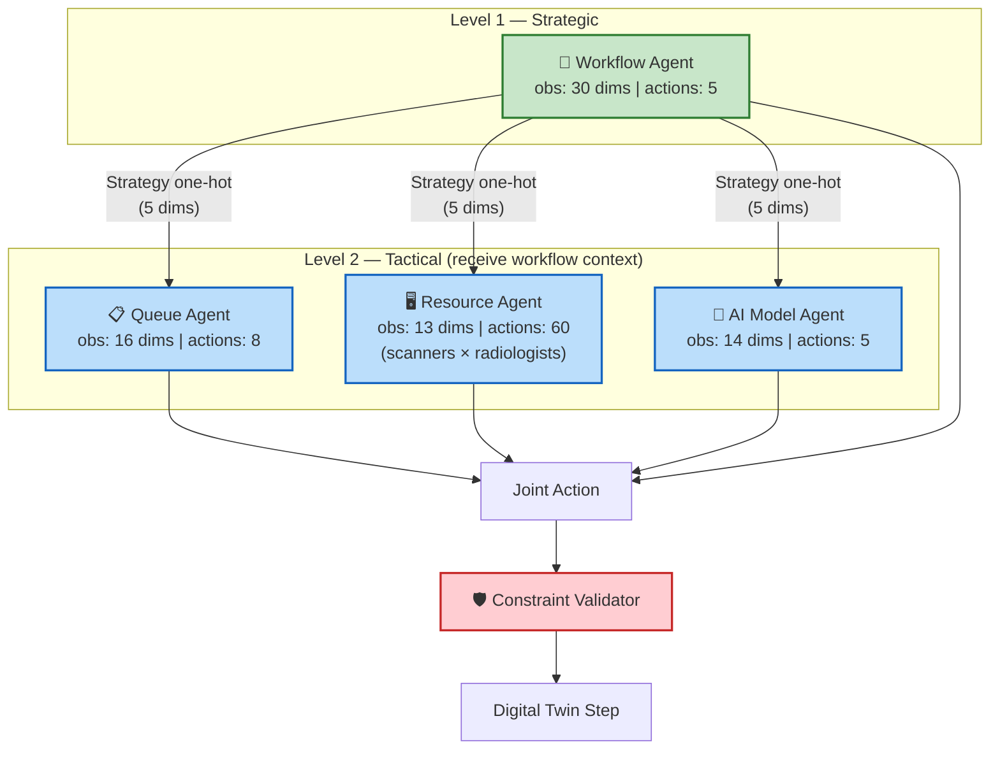

### Agent Observations (Heterogeneous)

Each agent sees a **different slice** of the global state:

| Agent | Dims | Components |
|-------|------|------------|
| **Workflow** | 30 | QueueState(8) + HumanResource(4) + ModelState(5) + SLAState(3) + WorkflowState(10) |
| **Queue** | 16 | QueueState(8) + SLAState(3) + WorkflowContext(5) |
| **Resource** | 13 | HumanResource(4) + ComputeState(4) + WorkflowContext(5) |
| **AI Model** | 14 | ModelState(5) + ComputeState(4) + WorkflowContext(5) |

### Constraint Validator (Safety Gate)

The Constraint Validator sits between agent decisions and the Digital Twin. It enforces **9 deterministic safety constraints**:

| # | Constraint | Action on Violation |
|---|-----------|---------------------|
| 1 | Emergency/critical priority cannot be violated | Reject |
| 2 | Unavailable scanner cannot be selected | Reject |
| 3 | Unavailable radiologist cannot be assigned | Reject |
| 4 | Unavailable AI model cannot be selected | Reject |
| 5 | GPU capacity cannot be exceeded | Reject |
| 6 | Memory capacity cannot be exceeded | Reject |
| 7 | Invalid workflow transition cannot occur | Reject |
| 8 | Completed study cannot be reprocessed | Reject |
| 9 | SLA-critical starvation (>30 min) | Force critical study |

---

## 6. RL Core (PPO / HAPPO)

### Neural Network Architecture

Each agent uses an independent **ActorCritic** network with separate actor and critic heads:

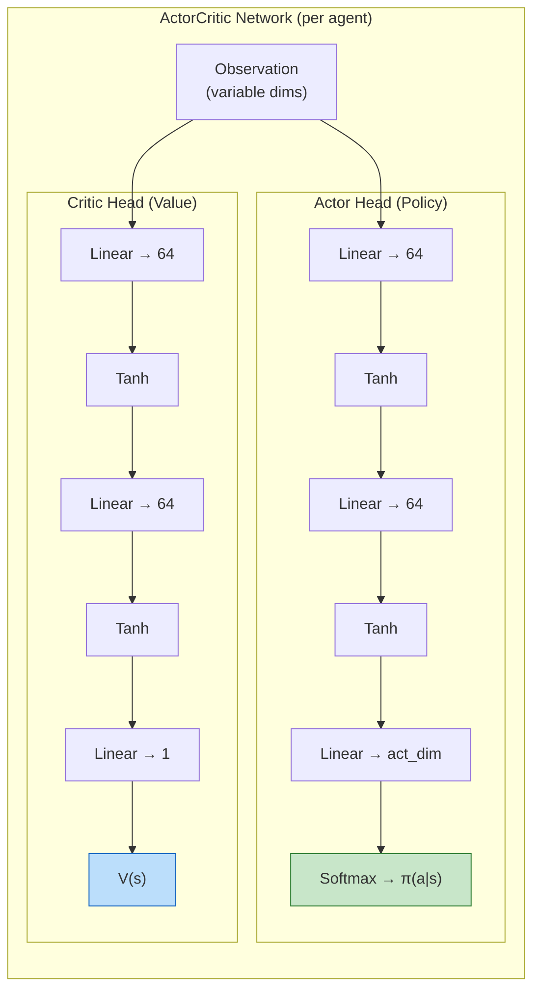

### HAPPO Sequential Update

**HAPPO (Heterogeneous-Agent PPO)** updates agents sequentially with a compound importance ratio M to guarantee monotonic improvement:

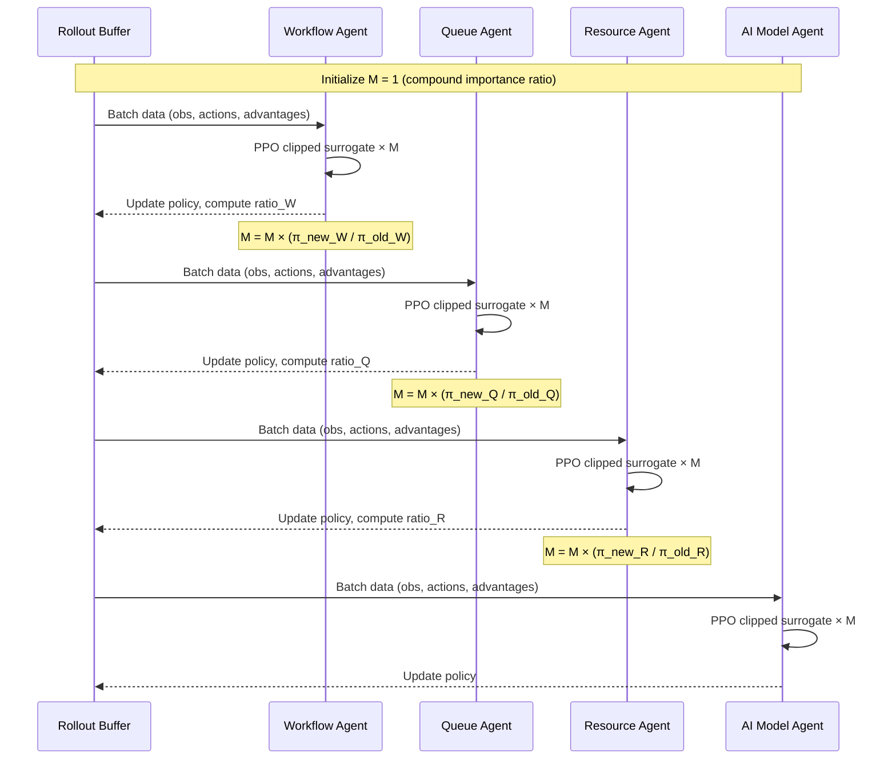

### Key PPO Hyperparameters

| Parameter | Default | Description |
|-----------|---------|-------------|
| `gamma` | 0.99 | Discount factor |
| `gae_lambda` | 0.95 | GAE lambda for advantage estimation |
| `clip_epsilon` | 0.20 | PPO clip range |
| `learning_rate` | 3e-4 | Adam optimizer LR |
| `batch_size` | 256 | Minibatch size |
| `ppo_epochs` | 10 | PPO update epochs per rollout |
| `entropy_coef` | 0.01 | Entropy bonus coefficient |
| `value_coef` | 0.5 | Value loss coefficient |
| `hidden_dim` | 64 | Hidden layer width |

---

## 7. Reward System

### Global Reward Formula

```
R_G = w1·C_SLA + w2·C_Clinical − w3·T_Queue − w4·T_Inference − w5·T_Report − w6·U_Resource − w7·I_Workload
```

All metrics are **normalized to [0, 1]** before weighting.

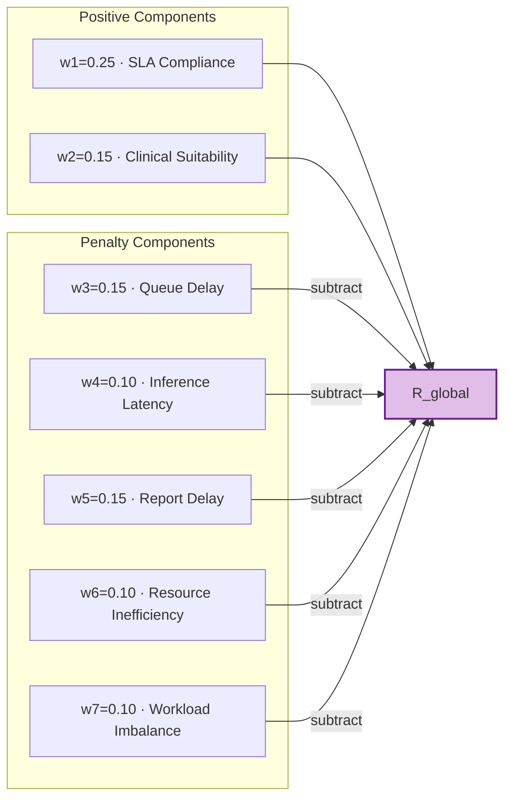

### Per-Agent Reward Mixing

Each agent receives a **blended reward**:

```
R_agent = α · R_local + β · R_global     (α = 0.6, β = 0.4)
```

| Agent | Local Reward Focus |
|-------|-------------------|
| **Workflow** | Strategy effectiveness, throughput |
| **Queue** | Queue delay reduction, priority adherence |
| **Resource** | Resource utilization balance, scanner efficiency |
| **AI Model** | Clinical suitability, inference speed |

---

## 8. Evaluation Framework

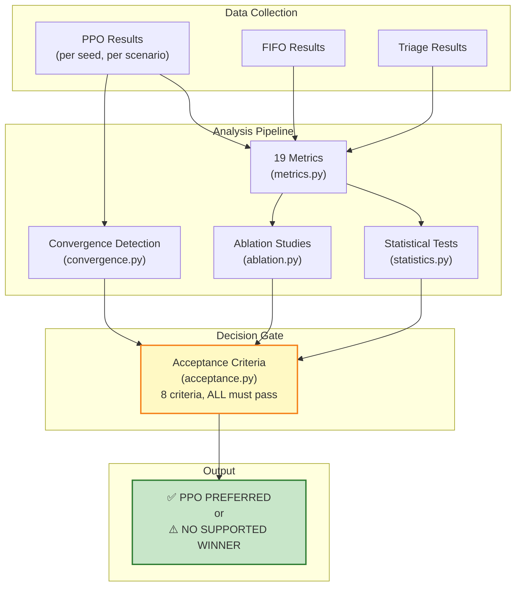

### 19 Metrics Tracked

**Primary (7):**
Mean TAT, Median TAT, P95 TAT, Mean Queue Wait, P95 Queue Wait, SLA Compliance, Critical Case Wait

**Secondary (12):**
Radiologist Workload Variance, Resource Utilization, Scanner Utilization, GPU Utilization, AI Inference Latency, SLA Violations, Critical Starvation Count, Throughput, Completed Studies, Rejected Actions, Constraint Violations, Policy Inference Time

### Acceptance Criteria (8 Gates)

PPO is declared "preferred" **ONLY if ALL 8 criteria pass**:

| Gate | Criterion | Threshold |
|------|-----------|-----------|
| A | Global reward improvement | ≥ 5% over best baseline |
| B | No degradation of critical-case priority | Critical delay ≤ baseline |
| C | SLA compliance | ≥ baseline |
| D | Queue delay & TAT improved | ≥ 5% reduction |
| E | Resource utilization acceptable | Balanced workload |
| F | Statistical significance | Welch's t-test / Mann-Whitney U |
| G | Consistent across seeds | ≥ 3 of 5 seeds agree |
| H | Generalizes to unseen scenarios | ≥ 1 unseen scenario |

> **If ANY criterion fails, PPO is NOT declared preferred.** This is critical for research integrity.

### Statistical Methods

| Method | Purpose |
|--------|---------|
| Welch's t-test | Compare means across policies |
| Mann-Whitney U | Non-parametric alternative |
| Bootstrap CI (n=10,000) | 95% confidence intervals |

---

## 9. Experiment Pipeline (18 Steps)

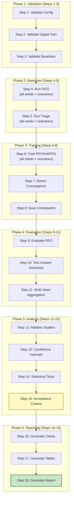

---

## 10. Web Dashboard

The dashboard is a **FastAPI** application that runs a live experiment on each request and renders interactive Plotly charts.

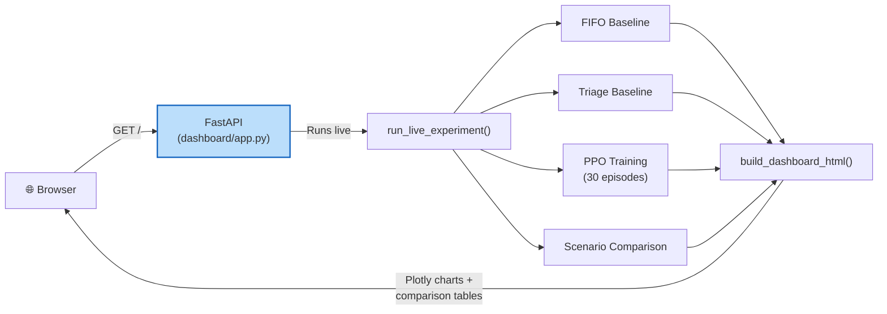

| Endpoint | Description |
|----------|-------------|
| `GET /` | Full interactive dashboard (runs live experiment) |
| `GET /api/health` | Health check (`{"status": "ok"}`) |

---

## 11. Key Design Decisions

| Decision | Rationale |
|----------|-----------|
| **Hierarchical agents** (L1 + L2) | Workflow strategy at L1 provides context to tactical L2 agents, reducing joint action space from multiplicative to additive |
| **Heterogeneous observations** | Each agent only sees relevant state components, improving learning efficiency |
| **HAPPO over independent PPO** | Sequential update with compound importance ratio M provides monotonic joint-policy improvement guarantees |
| **Deterministic constraint validator** | Safety constraints are NOT learned — they are hard-coded gates ensuring clinical safety regardless of RL policy |
| **Separate actor/critic networks** | Prevents gradient interference between policy and value objectives |
| **Blended rewards (α=0.6, β=0.4)** | Local rewards encourage specialization; global component ensures agents cooperate toward system-wide objectives |
| **Acceptance criteria gate** | PPO is NOT hard-coded to win — it must pass 8 rigorous criteria to be declared preferred |
| **Event-driven simulation** | More realistic than fixed-timestep simulation for hospital workflows with stochastic arrivals |

---

## 12. Technology Stack

| Component | Technology |
|-----------|-----------|
| Language | Python ≥ 3.10 |
| Deep Learning | PyTorch ≥ 2.0 |
| Web Framework | FastAPI + Uvicorn |
| Visualization | Plotly |
| Statistics | SciPy, NumPy |
| Data Handling | Pandas, OpenPyXL |
| Configuration | PyYAML |
| Logging | structlog |
| Serialization | Pydantic |

---

## 13. Dependency Map

```mermaid
graph TD
    CLI["medical_imaging_rl/cli.py"] --> TRAINER["rl/training/trainer.py"]
    EXP["experiments/runners/full_experiment.py"] --> TRAINER
    EXP --> BL_FIFO["baselines/fifo.py"]
    EXP --> BL_TRIAGE["baselines/triage.py"]
    EXP --> EVAL_M["evaluation/metrics.py"]
    EXP --> EVAL_S["evaluation/statistics.py"]
    EXP --> EVAL_A["evaluation/acceptance.py"]
    EXP --> RPT_C["reports/chart_generator.py"]
    EXP --> RPT_T["reports/table_generator.py"]
    EXP --> RPT_R["reports/report_generator.py"]

    TRAINER --> DT["simulator/digital_twin/environment.py"]
    TRAINER --> HAPPO["rl/happo/happo_trainer.py"]
    TRAINER --> AGENTS_W["agents/workflow/agent.py"]
    TRAINER --> AGENTS_Q["agents/queue/agent.py"]
    TRAINER --> AGENTS_R["agents/resource/agent.py"]
    TRAINER --> AGENTS_M["agents/model_selection/agent.py"]
    TRAINER --> CV["agents/constraint_validator.py"]
    TRAINER --> OBS["agents/observations.py"]
    TRAINER --> RW_G["rewards/global_reward.py"]
    TRAINER --> RW_W["rewards/workflow_reward.py"]
    TRAINER --> RW_Q["rewards/queue_reward.py"]
    TRAINER --> RW_R["rewards/resource_reward.py"]
    TRAINER --> RW_M["rewards/model_reward.py"]
    TRAINER --> CONV["evaluation/convergence.py"]

    HAPPO --> AC["rl/ppo/actor_critic.py"]
    HAPPO --> BUF["rl/ppo/buffer.py"]
    HAPPO --> GAE["rl/ppo/gae.py"]

    DT --> EV["simulator/events/"]
    DT --> ST["simulator/state/"]
    DT --> RS["simulator/resources/"]
    DT --> SC["simulator/scenarios/"]

    BL_FIFO --> DT
    BL_TRIAGE --> DT

    DASH["dashboard/app.py"] --> DT
    DASH --> BL_FIFO
    DASH --> BL_TRIAGE
    DASH --> TRAINER

    style TRAINER fill:#FFE0B2,stroke:#E65100,stroke-width:2px
    style DT fill:#E3F2FD,stroke:#1565C0,stroke-width:2px
    style HAPPO fill:#FFF9C4,stroke:#F57F17,stroke-width:2px
```

---

*Document generated for developer reference — LJMU Master's Thesis project.*
